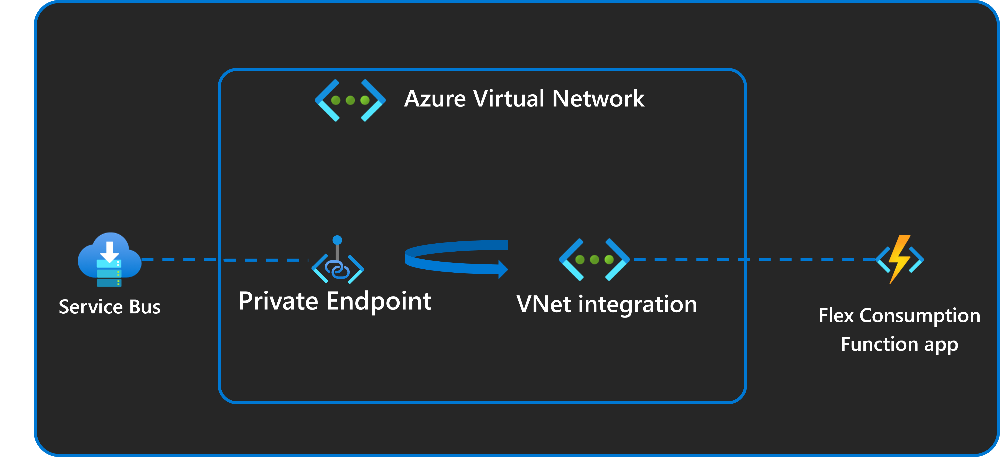

<!--
---
description: This end-to-end Python sample demonstrates the secure triggering of a Flex Consumption plan app from a Service Bus instance secured in a virtual network.
page_type: sample
products:
- azure-functions
- azure-service-bus
- azure
urlFragment: service-bus-trigger-virtual-network
languages:
- python
- bicep
- azdeveloper
---
-->

# Azure Functions with Service Bus Trigger and VNet Integration

An Azure Functions sample that demonstrates secure, scalable message processing using Service Bus with virtual network integration. This sample showcases a complete queue-based processing system with enterprise networking and security features.

## Architecture

This architecture shows how the Azure Function processes messages through Service Bus in a secure virtual network. The key components include:

* **Service Bus Queue**: Premium SKU with high-throughput message handling and VNet integration
* **Azure Functions Flex Consumption**: Automatically scales based on queue messages with VNet integration
* **Virtual Network**: Private endpoints for Service Bus and Storage with network isolation
* **Managed Identity Authentication**: Passwordless security for all Azure resource access
* **Azure Monitor**: Comprehensive logging and metrics for function execution and message processing

This serverless architecture enables highly scalable, event-driven message processing with built-in resiliency and enterprise security.



## Key Features

* **Service Bus Trigger** with advanced message processing
* **Azure Functions Flex Consumption** plan for automatic scaling
* **VNet integration** with private endpoints for enhanced security  
* **Azure Developer CLI (azd)** integration for easy deployment
* **Infrastructure as Code** using Bicep templates with Azure Verified Modules
* **Managed Identity authentication** for secure, passwordless access
* **Comprehensive monitoring** with Application Insights
* **Cross-platform development** with automatic local environment setup

## Sample Highlights

* **High Scale**: Low concurrency of 1 configured in `host.json` - scales to one instance per message
* **Virtual Network Integration**: Service Bus secured behind private endpoints accessible via VNet
* **Simulated Processing**: 30-second delay per message to demonstrate scaling behavior
* **Automatic Setup**: Postprovision scripts configure local development environment

> [!IMPORTANT]
> This sample creates several Azure resources. Make sure to clean up with `azd down` after testing to minimize charges!

## Prerequisites

* **Python 3.11+** and pip
* **Azure Functions Core Tools** - [Installation guide](https://docs.microsoft.com/azure/azure-functions/functions-run-local#install-the-azure-functions-core-tools)
* **Azure Developer CLI (azd)** - [Installation guide](https://docs.microsoft.com/azure/developer/azure-developer-cli/install-azd)
* **Azure CLI** - [Installation guide](https://learn.microsoft.com/cli/azure/install-azure-cli)
* **An Azure subscription** with Microsoft.Web and Microsoft.App [registered resource providers](https://learn.microsoft.com/azure/azure-resource-manager/management/resource-providers-and-types#register-resource-provider)

## Getting Started

### Quickstart

1. **Clone this repository**

   ```bash
   git clone https://github.com/nzthiago/functions-e2e-sb-vnet.git
   cd functions-e2e-sb-vnet
   ```

2. **Make sure to run this before calling azd to provision resources**

   Mac/Linux:
   ```bash
   chmod +x ./infra/scripts/*.sh 
   ```

   Windows:
   ```powershell
   Set-ExecutionPolicy RemoteSigned
   ```

3. **Sign in to Azure**

   ```bash
   azd auth login
   az login
   ```

4. **Provision Azure resources using azd**

   ```bash
   azd provision
   ```

   This will create all necessary Azure resources and create or update `local.settings.json` for local testing of the function app.

   The `azd provision` command automatically:
   * Adds your client IP to Service Bus network rules
   * Sets up managed identity authentication
   * Configures VNet integration and private endpoints
   * Creates the local development configuration file

5. **Start the function app locally**

   ```bash
   cd src
   func start
   ```

   Or use VS Code with the Azure Functions extension (press F5).

6. **Send test messages to verify local functionality**

   With the function app running locally, run the included Python test script from a different terminal:

   ```bash
   # Set up Python environment for testing
   cd test-send
   python -m venv venv
   source venv/bin/activate  # On Windows: venv\Scripts\Activate
   pip install azure-servicebus azure-identity

   # Send test messages (run from project root)
   python test_messages.py 5
   ```

   You should see console output like:

   ```
   🚀 Service Bus Message Sender
   ========================================
   🔐 Authenticating with Azure...
   📡 Connecting to Service Bus: sb-xxxxx.servicebus.windows.net
   📤 Sending 5 messages to queue: sbq-xxxxx
   ✅ Successfully sent 5 messages!
   ```

   And in your function terminal:

   ```
  [2025-11-17T18:18:25.054Z] Executing 'Functions.servicebus_queue_trigger' (Reason='(null)', Id=0ba2fc76-bf30-427e-8c74-ae7c7af98d58)
  [2025-11-17T18:18:25.055Z] Trigger Details: MessageId: c906657d-4172-4e43-84c4-353610cab8c0, SequenceNumber: 1, DeliveryCount: 1, EnqueuedTimeUtc: 2025-11-17T18:17:55.2570000+00:00, LockedUntilUtc: 2025-11-17T18:19:25.0260000+00:00, SessionId: (null)
  [2025-11-17T18:18:25.098Z] Python ServiceBus Queue trigger start processing a message: Test message 1/5 - sent at 2025-11-17 10:17:49
  [2025-11-17T18:18:55.090Z] Python ServiceBus Queue trigger end processing a message
  [2025-11-17T18:18:55.099Z] Executed 'Functions.servicebus_queue_trigger' (Succeeded, Id=0ba2fc76-bf30-427e-8c74-ae7c7af98d58, Duration=30060ms)
  [2025-11-17T18:18:55.303Z] Executing 'Functions.servicebus_queue_trigger' (Reason='(null)', Id=dd02c3b8-bbc0-4f21-98d7-1066c56c654f)
  [2025-11-17T18:18:55.303Z] Trigger Details: MessageId: 562fe1cb-1ad2-4e6c-bd51-d4114267b2b4, SequenceNumber: 2, DeliveryCount: 1, EnqueuedTimeUtc: 2025-11-17T18:17:55.2570000+00:00, LockedUntilUtc: 2025-11-17T18:19:55.3530000+00:00, SessionId: (null)
  [2025-11-17T18:18:55.305Z] Python ServiceBus Queue trigger start processing a message: Test message 2/5 - sent at 2025-11-17 10:17:49
  [2025-11-17T18:19:25.312Z] Python ServiceBus Queue trigger end processing a message
  [2025-11-17T18:19:25.313Z] Executed 'Functions.servicebus_queue_trigger' (Succeeded, Id=dd02c3b8-bbc0-4f21-98d7-1066c56c654f, Duration=30010ms)
   ```

When running locally, you have sequential processing as it's single instance processing messages (i.e., only your local machine), and the concurrency limit is set to 1 in [host.json](./src/host.json). Each message will take 30 seconds to complete as there's a [delay of 30 seconds](./src/function_app.py) in the python function app code.  When deployed to Azure with Flex Consumption, the behavior changes dramatically: with automatic scaling, Azure creates one instance per message and multiple messages are processed simultaneously.

7. **Deploy to Azure**

Stop the local function app, and then run the following command from the root folder of the sample:

   ```bash
   azd up
   ```

   This builds and deploys your function app to Azure, then verifies the deployment.

8. **Test the deployed function**

   * Navigate to your Function App in the Azure Portal
   * Go to Functions → **servicebus_trigger** → **Monitor** tab
   * Use Application Insights Live Metrics to see real-time processing
   * Send more messages using the test script to verify cloud functionality

### Scaling Configuration

The `host.json` file configures low concurrency to demonstrate scaling:

```json
{
  "version": "2.0",
  "functionTimeout": "00:10:00",
  "extensions": {
    "serviceBus": {
      "maxConcurrentCalls": 1
    }
  }
}
```

This ensures the function scales to multiple instances when processing multiple messages simultaneously. You can change this concurrency to allow an instance of the function app to process multiple messages in parallel, especially for lightweight processing.

## Networking and VNet Integration

This sample implements VNet integration with private endpoints for enhanced security.

### VNet Architecture

The deployment creates a comprehensive network architecture:

**Subnets:**
* **App Integration Subnet**: For Function App VNet integration
* **Service Bus Private Endpoints Subnet**: For Service Bus private endpoints  
* **Storage Private Endpoints Subnet**: For Storage Account private endpoints

**Private Endpoints:**
* **Service Bus**: Namespace private endpoint for secure queue access
* **Storage Account**: Blob, Table, and Queue private endpoints

**Security Features:**
* Public access to Service Bus and Storage is disabled
* All traffic flows through private endpoints within the VNet
* Client IP automatically added to Service Bus network rules for local development
* Managed Identity authentication eliminates connection strings

## Alternative Testing Methods

### Azure Portal (Simplest)
1. Navigate to Service Bus namespace → Queues → Your queue
2. Use **Service Bus Explorer** → **Send messages**
3. Enter test content and send multiple messages

### Python Test Script (Recommended)
```bash
# From project root
python test-send/test_messages.py 10  # Send 10 messages
```

## Clean Up Resources

When finished testing, clean up all Azure resources:

```bash
azd down
```

## Resources

* [Azure Functions Documentation](https://docs.microsoft.com/azure/azure-functions/)
* [Azure Service Bus Documentation](https://docs.microsoft.com/azure/service-bus/)
* [Azure Developer CLI Documentation](https://docs.microsoft.com/azure/developer/azure-developer-cli/)
* [Azure Functions Flex Consumption Plan](https://docs.microsoft.com/azure/azure-functions/flex-consumption-plan)
